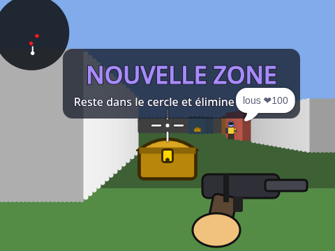
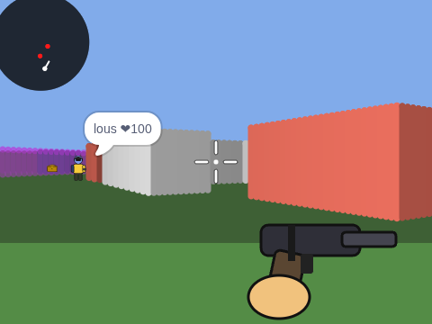

# Royale 3D — jeu de tir multijoueur 3D sur Scratch (façon Fortnite)

Un **FPS 3D multijoueur** entièrement en Scratch 3, synchronisé par **variables cloud**,
qui reprend les codes de Fortnite : zone qui se referme (tempête), armes, construction
de murs, coffres, bouclier, éliminations et **Victoire Royale**.

 

## Fichiers

| Fichier | Rôle |
|---|---|
| `Royale 3D.sb3` | Le projet Scratch prêt à importer (Fichier → Importer depuis votre ordinateur). |
| `generer_projet.py` | Le générateur Python qui construit le `.sb3` (tous les scripts Scratch y sont décrits). |

## Mise en ligne (obligatoire pour le multijoueur)

1. Ouvrir https://scratch.mit.edu → **Créer** → *Fichier → Importer depuis votre ordinateur* → `Royale 3D.sb3`.
2. Enregistrer le projet **en ligne** (compte connecté), puis **le partager**.
3. Jouer depuis la **page du projet** (pas depuis l'éditeur) : c'est là que les variables cloud sont actives.
4. Envoyer le lien aux autres joueurs : ils rejoignent automatiquement un des **6 emplacements**.

Contraintes imposées par Scratch :
- Les variables cloud ne fonctionnent que pour les comptes **Scratcher** (pas « Nouveau Scratcher ») et seulement en ligne.
- Les variables cloud ne stockent que des **nombres** : toutes les données sont codées en chiffres (voir plus bas).
- Scratch limite la vitesse d'envoi : les positions des autres joueurs sont rafraîchies ~5 à 10 fois par seconde.
- En solo ou dans l'éditeur hors ligne, le jeu tourne quand même (zone, coffres, construction) mais sans adversaires.

## Commandes (clavier AZERTY et QWERTY)

| Action | Touches |
|---|---|
| Avancer / reculer | `Z` ou `W` ou `↑` / `S` ou `↓` |
| Pas de côté | `Q` ou `A` / `D` |
| Tourner | souris vers les bords de la scène, ou `←` / `→` |
| Tirer | clic gauche (maintenu = tir automatique) |
| Sauter | `Espace` |
| Changer d'arme | `1` Pistolet · `2` Fusil à pompe · `3` Sniper |
| Viser à la lunette (sniper) | `C` maintenu |
| Recharger | `R` |
| Construire un mur devant soi | `B` (10 matériaux) |

## Règles de la partie

- **Manche de 150 s** : la zone (cercle violet sur la minicarte, mur violet en 3D) commence à se refermer après 40 s.
  Hors de la zone : −5 PV/s, puis −10 PV/s en fin de manche.
- **Éliminé** : réapparition après 5 s (mode « Rumble » : les éliminations comptent).
- **Fin de manche** : le joueur avec le plus d'éliminations voit **VICTOIRE ROYALE**, les autres **MANCHE TERMINÉE** ;
  nouvelle manche automatique ~50 s plus tard, nouvelle zone, murs construits effacés.
- **Coffres** (8 sur la carte, dorés) : +50 bouclier, +30 matériaux, chargeurs pleins.
- **Armes** : Pistolet 20 dégâts / 12 balles · Fusil à pompe jusqu'à 70 dégâts (baisse avec la distance) / 5 cartouches ·
  Sniper 95 dégâts / 3 balles, avec lunette.
- Le **bouclier** absorbe les dégâts des armes avant les PV (la tempête l'ignore, comme dans Fortnite).

## HUD

Moniteurs Scratch en français : `❤ PV`, `🛡 Bouclier`, `🔫 Munitions`, `🎯 Arme`, `🧱 Matériaux`,
`💀 Éliminations`, `👥 Joueurs`, `⏱ Zone` + minicarte circulaire (toi en blanc, adversaires en rouge, zone en violet),
viseur, marqueur de touche rouge, écran rouge quand on prend des dégâts, teinte violette hors zone.

## Comment ça marche

### Moteur 3D
Le sprite **Moteur3D** dessine chaque image au stylo : un **raycasting** (algorithme DDA) sur une grille 24×24
(`Carte`), 80 colonnes de 6 px, ombrage selon la distance et l'orientation du mur, matériaux colorés
(béton, bois construit, brique, métal). Les joueurs et les coffres sont des **panneaux** (sprites clones) placés
par projection caméra et masqués par les murs grâce au tampon `Profondeur`. Le **mur de tempête** est l'intersection
rayon/cercle de la zone, tracé en violet semi-transparent.

### Réseau (variables cloud)
- `☁ J1` … `☁ J6` : un **paquet de 50 chiffres** par joueur, réécrit dès qu'il change (max 10 fois/s) :

  | Position | Champ |
  |---|---|
  | 1 | préfixe `1` (préserve les zéros de tête) |
  | 2–5 / 6–9 | x, y × 100 |
  | 10–12 | direction |
  | 13–15 / 16–18 | PV, bouclier |
  | 19–23 | battement de cœur (secondes) → un emplacement sans battement depuis 15 s est libre |
  | 24 / 25–26 / 27–28 | cible touchée, n° de tir, dégâts (le **tireur** détecte la touche, la **victime** applique les dégâts quand elle voit un nouveau n° de tir qui la vise) |
  | 29 / 30 | tueur, compteur de morts (permet de créditer l'élimination) |
  | 31 / 32 | arme, état (1 vivant, 2 éliminé) |
  | 33–48 | pseudo (8 lettres codées sur 2 chiffres) |
  | 49–50 | éliminations (classement de fin de manche) |

- `☁ Partie` : horodatage du début de manche (secondes) ; la zone, le compte à rebours et le classement en découlent,
  donc tous les joueurs voient la même zone sans échange supplémentaire.
- `☁ Construction` : liste des murs construits (`xxyy` par mur), remise à `1` à chaque manche.

Points d'attention connus (choix assumés) : la comparaison `=` de Scratch étant numérique, les paquets sont
comparés avec un préfixe `#` ; les horloges des joueurs peuvent différer, d'où un écart signé modulo 100000 s.

## Regénérer / modifier

```bash
python3 generer_projet.py
```
Le script écrit `Royale 3D.sb3`. Pour changer la carte, éditer `CARTE_ASCII` ; pour les armes, les listes
`ArmeDegats`, `ArmeCadence`, `ArmePortee` ; pour le nombre de joueurs, `NB_JOUEURS` (10 variables cloud max par projet).
