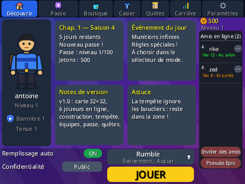
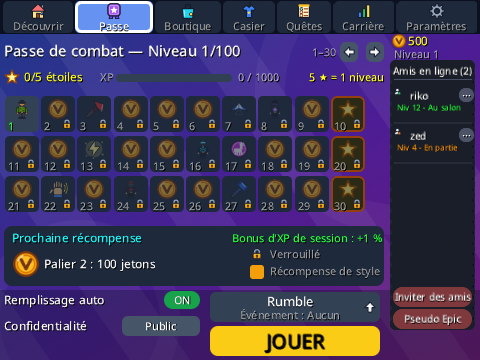
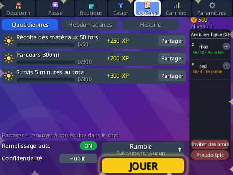
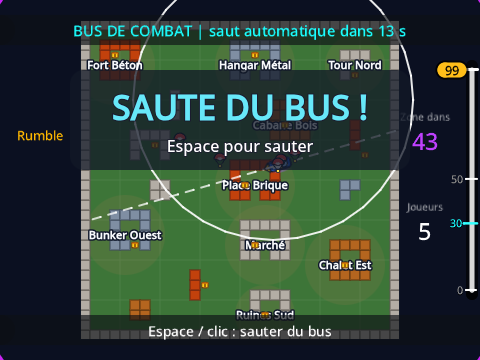
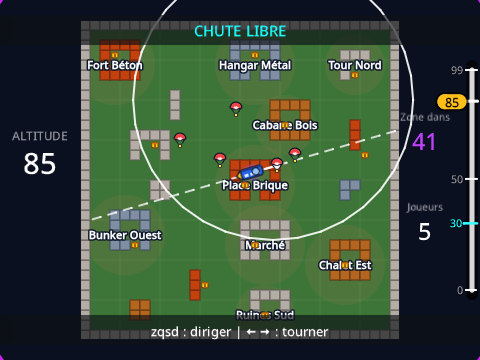
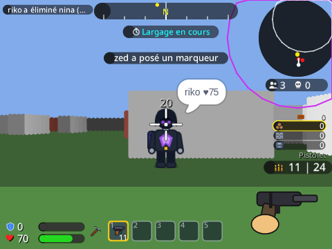
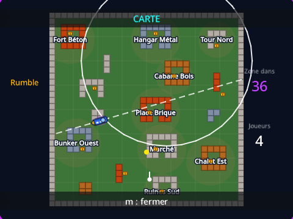
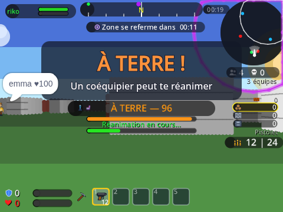
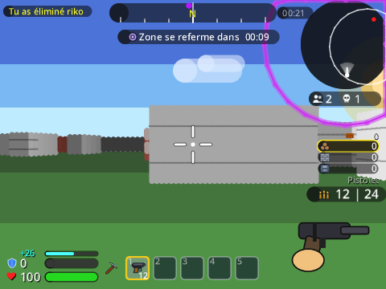

# Royale 3D — battle royale 3D multijoueur sur Scratch (façon Fortnite)

Un **jeu de tir 3D multijoueur** entièrement en Scratch 3, synchronisé par **variables cloud**,
qui reprend les systèmes de Fortnite : salon et onglets (passe de combat, boutique, casier, quêtes,
carrière, paramètres), matchmaking, île d'attente, bus de combat, parachute, zone de tempête en
5 phases, construction, coffres, 6 armes à 5 raretés (pistolet, fusil à pompe, sniper, fusil d'assaut,
pistolet-mitrailleur, lance-grenades à dégâts de zone), largages de ravitaillement, lama à butin,
à terre / réanimation / redéploiement, HUD complet, chat rapide,
émotes, pings, spectateur, XP, saisons, succès… Le détail des 128 éléments demandés et leur statut
(fait / adapté / impossible sur Scratch) est dans [`docs/CORRESPONDANCE.md`](docs/CORRESPONDANCE.md).

| | | |
|---|---|---|
|  |  |  |
|  |  |  |
|  |  |  |

## Fichiers

| Chemin | Rôle |
|---|---|
| `Royale 3D.sb3` | Le projet Scratch prêt à importer (Fichier → Importer depuis votre ordinateur). |
| `generer_projet.py` | Génère le `.sb3` à partir des modules Python (`python3 generer_projet.py`). |
| `royale/` | Le code : `dsl.py` (blocs Scratch), `contrat.py` (tout ce qui est partagé), `joueur.py`, `moteur3d.py`, `overlays.py`, `texte.py` (moteur de texte), `sons.py`, `svg.py` / `svg_ui.py` (costumes), `mod_partie.py`, `mod_systemes.py`, `mod_menus.py`, `mod_hud.py`, `mod_social.py`. |
| `outils/` | Banc de test : exécution dans scratch-vm (`node outils/test_vm.js`), rendu réel Chromium et captures (`node outils/capture.js …`), scénarios dans `outils/scenarios/`. |
| `docs/` | `GUIDE_MODULES.md` (comment écrire un module), `CORRESPONDANCE.md` (fonctionnalités). |

## Mise en ligne (obligatoire pour le multijoueur)

1. https://scratch.mit.edu → **Créer** → *Fichier → Importer depuis votre ordinateur* → `Royale 3D.sb3`.
2. Enregistrer **en ligne** puis **partager** le projet.
3. Jouer depuis la **page du projet** : c'est là que les variables cloud sont actives.
4. Partager le lien : jusqu'à **6 joueurs** rejoignent automatiquement (code de salon possible pour jouer entre amis).

Limites imposées par Scratch (et contournements choisis) :
- Variables cloud réservées aux comptes **Scratcher**, numériques uniquement, 10 par projet, ~10 écritures/s :
  tout est codé en chiffres (paquet de 87 chiffres par joueur), les positions des autres se rafraîchissent 5 à 10 fois par seconde.
- Pas de stockage par joueur : la progression (XP, jetons, cosmétiques, succès) se conserve via un **code de sauvegarde** à copier.
- Pas de chat libre (interdit par les règles Scratch sur le cloud) : **chat rapide** de phrases prédéfinies ; pas de voix.
- Un seul serveur cloud : la « région » est indicative, le matchmaking par niveau est affiché mais pas un vrai tri.
- 30 images/s maximum ; la qualité graphique (40/80/120 colonnes) et le mode performance s'adaptent aux machines lentes.

## Commandes (configurables dans Paramètres → Commandes, presets AZERTY / QWERTY)

| Action | Touche | Action | Touche |
|---|---|---|---|
| Avancer / reculer | `Z` / `S` (ou flèches) | Construire un mur | `B` (ou mode construction + clic) |
| Pas de côté | `Q` / `D` | Matériau suivant | `N` |
| Tourner | souris vers les bords ou `←` `→` | Édition (retirer un mur) | `G` |
| Tirer / utiliser | clic gauche | Pioche (récolte, destruction) | `F` |
| Viser (sniper) | `C` | Interagir (coffre, réanimer, redéployer) | `E` |
| Sauter / sauter du bus | `Espace` | Carte plein écran | `M` |
| Sprint | `X` | Menu pause | `P` |
| Recharger | `R` | Chat rapide / Émotes / Sprays / Ping | `T` / `Y` / `H` / `V` |
| Inventaire | `1` à `5` | Spectateur : changer de joueur | `←` `→` |

## Déroulé d'une partie

Salon → **JOUER** → matchmaking → chargement → **île d'attente** (25 s, invulnérable) → **bus de combat**
(trajectoire aléatoire, `Espace` pour sauter) → **parachute / planeur** → combat avec 5 phases de tempête
(dégâts croissants, dernière zone en mouvement) → fin de partie et récapitulatif (XP, placement, **Victoire Royale**).
La manche est **partagée par tout le serveur** : `☁ Partie` fixe l'heure de départ, le mode, l'événement et la graine ;
un joueur qui arrive en cours de manche saute directement du bus au-dessus de la zone (ou observe pendant la dernière zone).
Modes : Solo, Duo, Trio, Sections (à terre, réanimation, cartes et balises de redéploiement), Rumble (réapparition),
Arène (points de hype et divisions). Événements limités : Pompes uniquement, Snipers uniquement, Tempête éclair,
Munitions infinies, Gravité faible.

## Comment ça marche

- **Moteur 3D** : raycasting DDA au stylo sur une grille 32×32 (9 lieux nommés), colonnes de rendu variables,
  panneaux 3D pour joueurs (10 tenues, poses à terre / émote), coffres, largages (caisse sous ballon qui descend), lama,
  balises, marqueurs, sprays, mur de tempête, minicarte.
- **Réseau** : `☁ J1…☁ J6` (un paquet par joueur : position, direction, PV, boucliers, battement de cœur,
  dernier tir, état, pseudo, équipe, émote, ping, chat, code de salon, altitude, réanimation, cosmétiques, statistiques),
  `☁ Partie` (début de manche, mode, événement, graine : la zone et le bus sont déterministes pour tous),
  `☁ Construction` + `☁ Construction2` (murs construits / détruits), `☁ Record` (meilleurs joueurs).
  Les coups sont détectés par le tireur et appliqués par la victime ; les morts, mises à terre, émotes, pings et
  messages sont déduits des changements de compteurs. Reconnexion : un emplacement portant ton pseudo est repris.
- **Texte** : Scratch n'a pas de bloc texte ; un moteur de glyphes tamponne chaque caractère au stylo (FR/EN).
- **Sons** : synthétisés en Python (WAV) ; volumes musique / effets / voix, panoramique selon la direction.

## Développer

```bash
python3 generer_projet.py              # construit le .sb3 et outils/contrat.json
cd outils && npm install               # une fois (scratch-vm, playwright)
node test_vm.js                        # tous les scénarios (456 vérifications)
node capture.js captures_scripts/jeu_base.js   # captures réelles dans outils/captures/
```
Voir `docs/GUIDE_MODULES.md`.
